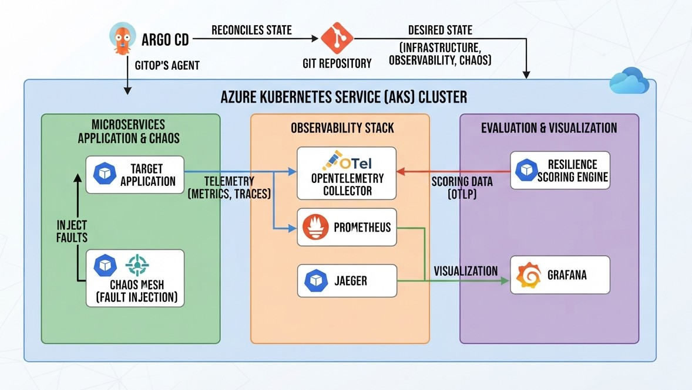
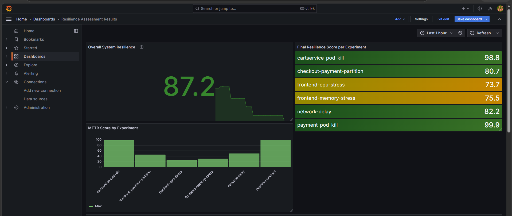

# Automated Resilience Assessment Platform for Kubernetes Applications
 
Kubernetes can restart a failed pod in seconds, but that doesn't mean the application is actually resilient. This platform deploys a Kubernetes application on Azure Kubernetes Service (AKS), injects controlled failures into it using Chaos Engineering, collects the resulting telemetry, and automatically converts the results into a quantitative resilience score (0–100), based on Site Reliability Engineering (SRE) principles.
 
It combines four ingredients:
 
- **GitOps**: ArgoCD manages the entire environment declaratively from this repository, using an App-of-Apps pattern.
- **Observability**: OpenTelemetry, Prometheus, Jaeger, and Grafana collect and visualize metrics, traces, and application health.
- **Chaos Engineering**: Chaos Mesh injects controlled failures (pod kills, network delay, network partitions, CPU/memory stress) into the target application.
- **Automated scoring**: a custom Python scoring engine transforms the observed impact into three normalized indicators (availability, MTTR, error-budget burn rate), combined into a final resilience score.

The target application is the **OpenTelemetry Astronomy Shop**, an open-source e-commerce microservice demo.


 
## Architecture
 
Telemetry flows as:
 
`Application → OpenTelemetry → Prometheus / Jaeger → Grafana`
 
Resilience scores flow as:
 
`Scoring Engine → OTLP → OpenTelemetry Collector → Prometheus → Grafana`
 

 
The desired state of the whole platform (infrastructure, observability stack, chaos experiments) lives in Git and is reconciled onto the AKS cluster by ArgoCD.
 
## Repository structure
 
- `apps/`: ArgoCD Application definitions for each platform component (chaos-mesh, observability, otel-demo, chaos-experiments).
- `bootstrap/`: initial ArgoCD configuration and the parent Application that bootstraps everything else.
- `chaos-experiments/`: version-controlled Chaos Mesh experiment manifests (pod-kill, network, stress).
- `dashboards/`: Grafana dashboard definitions (health baseline, chaos experiments, resilience scoreboard).
- `resilience-scoring/`: the automated scoring engine.
- `terraform/`: Azure infrastructure definitions (AKS, networking, Key Vault, Terraform state storage).
## Azure infrastructure
 
The infrastructure is provisioned entirely with Terraform, following an Infrastructure-as-Code approach.
 
**Networking**
 
| Component | Configuration |
|---|---|
| Virtual Network | `10.0.0.0/16` |
| AKS Subnet | `10.0.1.0/24` |
| Kubernetes Service CIDR | `10.96.0.0/16` |
| Kubernetes DNS | `10.96.0.10` |
| Network Plugin | Azure CNI |
| Network Policy | Azure |
 
**Node pools**
 
| Node pool | VM size | Nodes | Role |
|---|---|---|---|
| `default` | Standard_D2s_v5 | 1 | System and platform components (ArgoCD, Chaos Mesh controller) |
| `workpool` | Standard_D4s_v5 | 1–4 (autoscaling) | Application and chaos-experiment workloads |
 
The two pools are kept separate so that resource pressure generated by CPU/memory stress experiments cannot degrade the platform components responsible for managing and observing the experiments themselves.
 
**Supporting services**
 
| Component | Purpose |
|---|---|
| Azure Key Vault | Secure storage for secrets (GitHub PAT used by ArgoCD) |
| Azure Storage | Remote backend for Terraform state |

## Chaos experiments
 
Each experiment is defined as a Chaos Mesh Custom Resource, version-controlled in `chaos-experiments/`, and targets a specific service or dependency in the application.
 
| Category | Experiment | Chaos Mesh CRD | Target | Fault injected | Score |
|---|---|---|---|---|---|
| Pod failure | Cart service failure | `PodChaos` | `cart` | Pod termination | 98.8 |
| Dependency failure | Payment service failure | `PodChaos` | `payment` | Pod termination (impact measured on `checkout`) | 99.9 |
| Network degradation | Network delay | `NetworkChaos` | `frontend` ↔ `product-catalog` | Added latency | 82.2 |
| Network failure | Network partition | `NetworkChaos` | `checkout` ↔ `payment` | Communication interruption | 80.7 |
| Resource exhaustion | CPU stress | `StressChaos` | `frontend` | CPU load | 73.7 |
| Resource exhaustion | Memory stress | `StressChaos` | `frontend` | Memory consumption | 75.5 |
 
Each experiment follows the same execution workflow: establish a baseline under normal conditions, inject the fault, observe the impact and recovery over a fixed observation window through the observability stack, then restore the environment via GitOps before the next run.
 
## Scoring methodology
 
Each experiment is evaluated over a fixed observation window (default 300 seconds) using three metrics, each normalized to a 0–100 scale:
 
- **Availability**: proportion of successful requests during the experiment.
- **MTTR**: how quickly the affected component or metric returns to an acceptable state; the recovery condition depends on the failure type (pod readiness, latency, CPU/memory usage).
- **Error-budget burn rate**: how fast the observed unreliability consumes the error budget defined by a 99% SLO.

The final score is a weighted sum: 35% availability, 35% MTTR, 30% burn rate, favoring service continuity and recovery speed equally, with burn rate as a complementary SRE-oriented signal.
## Dashboards
 
Three Grafana dashboards, defined in `dashboards/`, support the resilience assessment at different stages.
 
| Dashboard | Purpose | Key panels |
|---|---|---|
| Health Baseline | Establishes the application's normal operating behavior (RED method) before any fault is injected | Request rate, error rate, and p99 latency per service |
| Chaos Experiments | Visualizes the impact and recovery of each injected fault, one panel group per experiment | Pod lifecycle, request rate, latency, CPU/memory usage during the experiment window |
| Resilience Scoreboard | Consolidates the quantitative results produced by the scoring engine | Overall resilience score, final score per experiment, MTTR score by experiment |
 
The Chaos Experiments dashboard is complemented by Jaeger for communication-related faults (network delay and partition), where distributed traces provide additional visibility into which service-to-service call was affected.

## Results
 
Six chaos experiments were run against the target application, producing an **overall resilience score of 87.2/100**:
 
| Experiment | Score |
|---|---|
| Payment pod kill | 99.9 |
| Cart service pod kill | 98.8 |
| Network delay (frontend ↔ product catalog) | 82.2 |
| Checkout ↔ Payment network partition | 80.7 |
| Frontend memory stress | 75.5 |
| Frontend CPU stress | 73.7 |


 
Pod failures scored highest, since Kubernetes' self-healing recreates terminated pods quickly. 

Network disruptions and resource exhaustion scored lower, the application stays technically available, but latency and recovery time degrade more, which availability alone would not capture.
 
---

## Deployment Guide

## 1. Azure Login

Authenticate to Azure:

```bash
az login
```

## 2. Create Terraform Backend Storage

Create the resource group for Terraform state:

```bash
az group create --name rg-astro-backend --location francecentral
```

Create the storage account for Terraform state:

```bash
az storage account create \
  --name astrotfstate \
  --resource-group rg-astro-backend \
  --location francecentral \
  --sku Standard_LRS \
  --kind StorageV2 \
  --allow-blob-public-access false \
  --min-tls-version TLS1_2
```

Create the blob container:

```bash
az storage container create \
  --name tfstate \
  --account-name sttfstateresiliencepfe \
  --auth-mode login
```

Get the current subscription ID:

```bash
az account show --query id --output tsv
```

Set the subscription ID environment variable:

```bash
export ARM_SUBSCRIPTION_ID="<subscription-id>"
```

## 3. Provision Infrastructure with Terraform

Run Terraform from the `terraform/` directory to provision the infrastructure:

```bash
cd terraform
terraform init
terraform apply
```

## 4. Connect to the AKS Cluster

Get AKS credentials:

```bash
az aks get-credentials \
  --resource-group rg-astro \
  --name astro-aks1
```

Verify the cluster nodes:

```bash
kubectl get nodes
```

## 5. Install Argo CD

Add the Argo Helm repository and update local charts:

```bash
helm repo add argo https://argoproj.github.io/argo-helm
helm repo update
```

Install Argo CD into the `argocd` namespace using the bootstrap values:

```bash
helm install argocd argo/argo-cd \
  --namespace argocd \
  --create-namespace \
  --values bootstrap/argocd-values.yaml \
  --wait
```

Check Argo CD pods:

```bash
kubectl get pods -n argocd -o wide
```

Expose the Argo CD server as a LoadBalancer:

```bash
kubectl patch svc argocd-server -n argocd -p '{"spec": {"type": "LoadBalancer"}}'
```

Get the Argo CD server IP address:

```bash
kubectl get svc argocd-server -n argocd -o=jsonpath='{.status.loadBalancer.ingress[0].ip}'
```

Get the initial admin password:

```bash
argocd admin initial-password -n argocd
```

Login to Argo CD:

```bash
argocd login <ARGOCD_SERVER_IP> --username admin --insecure
```

## 6. Connect GitHub to Argo CD

Store your GitHub personal access token in Azure Key Vault:

```bash
az keyvault secret set \
  --vault-name astro-kv \
  --name github-pat \
  --value "<your-github-PAT>"
```

Verify the secret is stored:

```bash
az keyvault secret list --vault-name astro-kv --output table
```

Add the GitHub repository to Argo CD using the secret value:

```bash
argocd repo add https://github.com/yasmineelhakem/resilience-platform.git \
  --username yasmineelhakem \
  --password $(az keyvault secret show \
      --vault-name astro-kv \
      --name github-pat \
      --query value \
      --output tsv)
```

Verify the repo is added:

```bash
argocd repo list
```

## 7. Deploy the App of Apps

Apply the bootstrap parent application manifest:

```bash
kubectl apply -f bootstrap/parent-app.yaml
```

Check the Argo CD application list:

```bash
argocd app list
```

## 8. Access the Deployed Endpoints

After the applications are deployed, you can access them locally using port-forwarding.

### OTel Demo UI

```bash
kubectl -n otel-demo port-forward svc/frontend-proxy 8080:8080
```

Open:

```text
http://localhost:8080
```

### Prometheus

```bash
kubectl -n observability port-forward svc/kube-prometheus-stack-prometheus 9090:9090
```

Open:

```text
http://localhost:9090
```

### Grafana

```bash
kubectl -n observability port-forward svc/kube-prometheus-stack-grafana 3000:80
```

Open:

```text
http://localhost:3000/
```

Default credentials:

```text
Username: admin
Password: admin
```

### Chaos Mesh Dashboard

```bash
kubectl -n chaos-mesh port-forward svc/chaos-dashboard 2333:2333
```

Open:

```text
http://localhost:2333
```

### Jaeger UI

The Jaeger UI is available through the OTel Demo frontend:

```text
http://localhost:8080/jaeger/ui
```